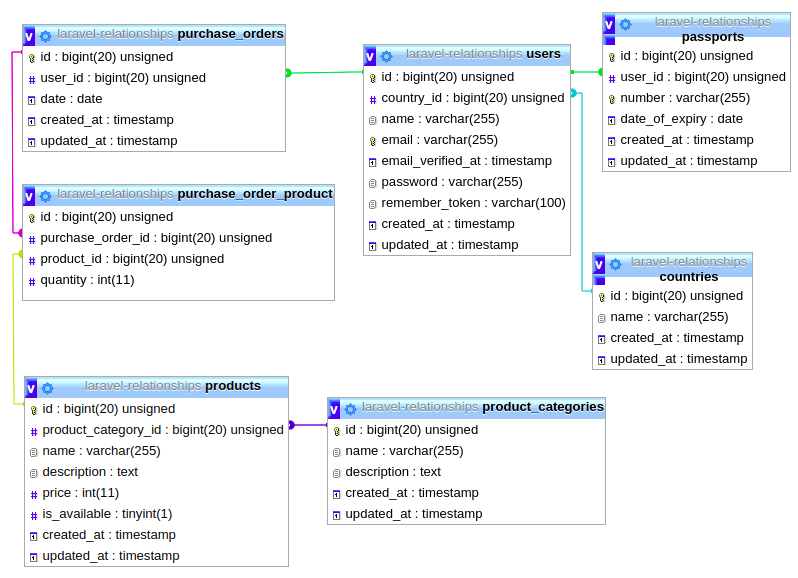

<p align="center"></p>

# Laravel Relationships Examples

* **Models**

    ```text
    Country
    User
    ProductCategory
    Product
    PurchaseOrder
    ProductPurchaseOrder (Pivot)
    ```


* **Database Schema**




* [Laravel Web Tinker](/tinker): Test your queries in the browser
* [Eloquent Cheat Sheet](md/eloquent-cheat-sheet.md)

